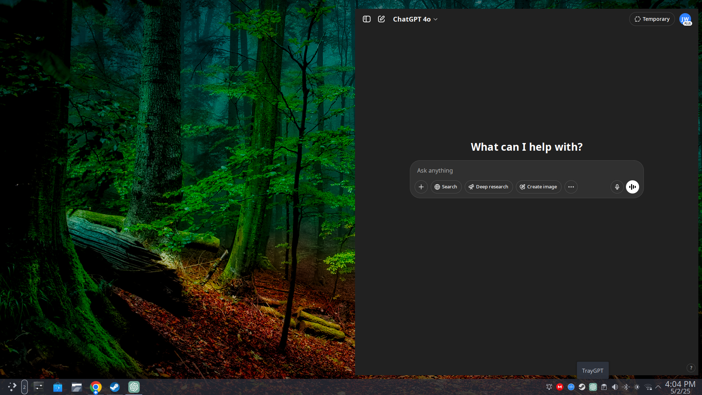

# TrayGPT

**TrayGPT** is a floating, always-on-top ChatGPT overlay built with Electron.  
It runs from your system tray and keeps ChatGPT a single click away — distraction-free, lightweight, and minimal.



---

## ✨ Features

- 🧠 Full ChatGPT web UI
- 📌 Always-on-top frameless window
- 🔄 Auto-hide on focus loss (optional)
- 📦 AppImage builds for easy install
- 🔗 External links open in system browser
- 🛠️ Settings UI (dock location, window size, etc.)

---

Download and run the latest AppImage or Wine32 EXE from the Releases page. 


## 🚀 Install from Source

```bash
# Clone the repo
git clone https://github.com/onemyndseye/TrayGPT.git
cd TrayGPT

# Install dependencies
npm install

# Run a live session
npm start

-OR-

# Build the AppImage
npm run build

# Run the built AppImage
./dist/TrayGPT-xx.xx.xx.AppImage
